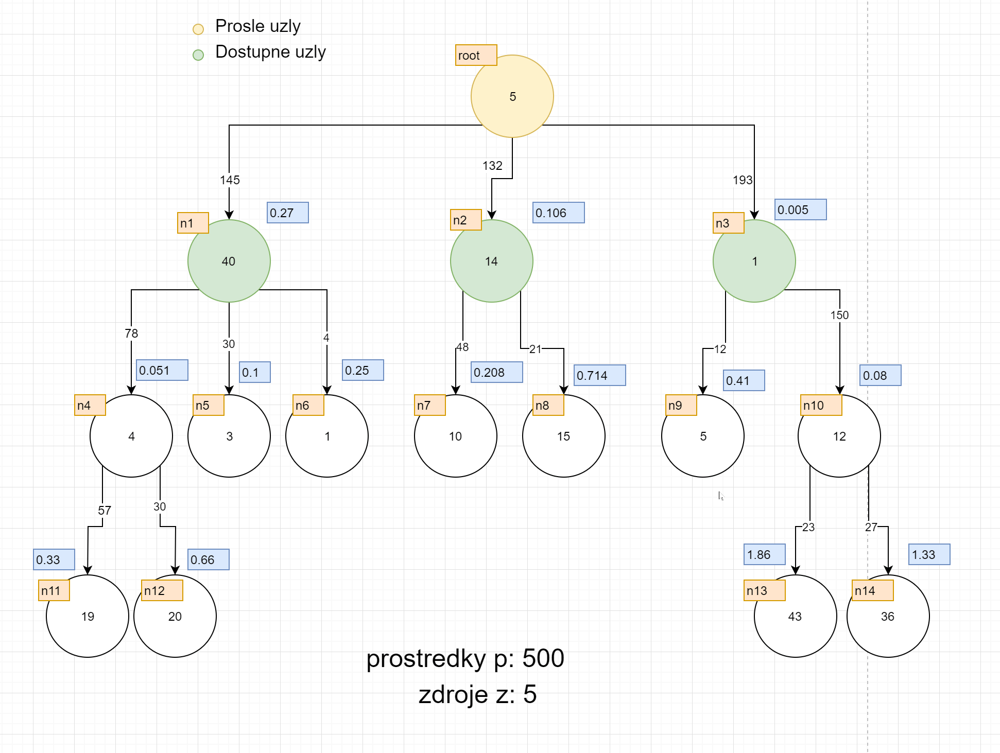

# js-knapsack

JavaScript implementation of the knapsack problem (https://en.wikipedia.org/wiki/Knapsack_problem) using a greedy algorithm that looks at the value/cost ratio.

> The knapsack problem is a problem in combinatorial optimization: Given a set of items, each with a weight and a value, determine the number of each item to include in a collection so that the total weight is less than or equal to a given limit and the total value is as large as possible.

